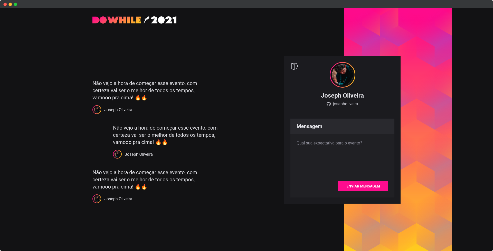

<div align="center">
  
</div>

## Do While 2021

[](https://github.com/josepholiveira)
[](#)
[](https://github.com/josepholiveira/dowhile-2021/stargazers)

<h4 align="center">
  DoWhile 2021 is a platform built during the NLW Heat event by @Rocketseat in October 2021. It lets you gather hype messages for the DoWhile event that will happen during days 01 and 02 of december 2021.
</h4>



## Tecnologies

This project was developed using cutting edge front-end technologies.

- [ReactJS](https://reactjs.org/)
- [Typescript](https://www.typescriptlang.org/)
- [Vite](https://vitejs.dev/)

## 💻 Getting started

### Requirements

- You need to install both [Node.js](https://nodejs.org/en/download/) and [Yarn](https://yarnpkg.com/) to run this project.

- You also need the back-end for this front-end to work. You can find how to use it [here](https://github.com/rocketseat-education/nlw-heat-node).

**Clone the project and access the folder**

```bash
$ git clone https://github.com/josepholiveira/dowhile-2021.git && cd dowhile-2021
```

**Follow the steps below**

```bash
# Install the dependencies
$ yarn

# Remember to configure your .env.local following the .env.exemple

# Run the web server
$ yarn dev
```

The app will be available for access on your browser at `http://localhost:3000`

## 📝 License

This project is licensed under the MIT License - see the [LICENSE](LICENSE) file for details.

---

Made with 💜 by Joseph Oliveira 👋 [Check out my LinkedIn](https://www.linkedin.com/in/joseph-oliveira-294a19165)
